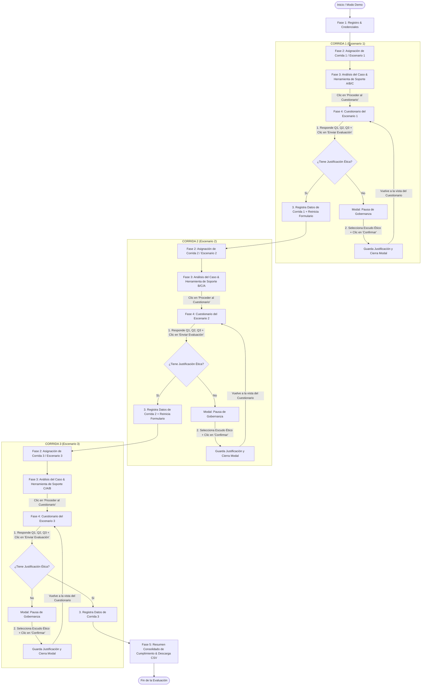

# Diagrama del Flujo Secuencial Completo - Modo Demo y Experimento

**Proyecto:** Incident Responder AI 2.0 / Evaluador Multiagentes INFOTEC  
**Fecha de generación:** 2026-07-27  
**Descripción:** Especificación técnica del diagrama de secuencia para el flujo experimental de 3 corridas con Pausa de Gobernanza integrada.

---

## 1. Diagrama de Secuencia Mermaid

---

## 2. Descripción Paso a Paso del Protocolo

1. **Paso 1 (Primer clic en "Enviar Evaluación"):**
   - El participante responde las 3 preguntas en la **Fase 4**.
   - Al presionar **Enviar Evaluación**, el sistema detecta que la pregunta de decisión de cumplimiento no cuenta aún con una justificación ética guardada.
   - Se despliega la ventana modal emergente de la **Pausa de Gobernanza**.

2. **Paso 2 (Confirmar Justificación):**
   - El participante selecciona la tarjeta con el argumento ético/deontológico/utilitarista.
   - Presiona el botón **Confirmar Justificación**.
   - El modal se cierra y el participante **vuelve a la vista del Cuestionario (Fase 4)** con sus opciones seleccionadas y la justificación debidamente registrada en el estado de la sesión.

3. **Paso 3 (Segundo clic en "Enviar Evaluación"):**
   - Al presionar **Enviar Evaluación** nuevamente, el sistema valida que las respuestas están completas y que la justificación ética ya existe.
   - Se guardan en memoria silenciosa (o Firestore) los logs de latencia, precisión y respuestas del Escenario 1.
   - El sistema avanza automáticamente a la tarjeta de la **Corrida 2 (Escenario 2)**.

4. **Ciclo de 3 Corridas:**
   - El mismo proceso paso a paso se repite de manera independiente para el **Escenario 2** y el **Escenario 3**.
   - Tras completar el Escenario 3, el sistema deriva al participante a la **Fase 5 (Resumen Consolidado de Cumplimiento)** donde se puede descargar el informe final en formato CSV.
