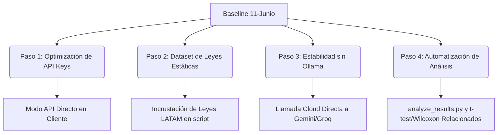

# Reporte de Evaluación Baseline (Punto de Partida) - INFOTEC

**Fecha de Ejecución:** Jueves 11 de Junio, 2026 (12:45 PM hora local)  
**Entorno de Prueba:** Local VirtualEnv (Python 3.12)  
**Objeto Evaluado:** `scripts/infotec_eval_harness.py`  
**Caso de Prueba Utilizado:** Escenario 1 (Brecha de Datos Financieros - Uruguay BCU / México CNBV)  

---

## 1. Resultados de la Evaluación por Grupo

### Grupo A: Búsqueda Regulatoria Manual (RAG Puro)
*   **Latencia de Carga y Búsqueda:** 7.950 segundos (incluye carga del modelo local de embeddings `all-MiniLM-L6-v2` mediante CPU).
*   **Documentos Recuperados:**
    1.  `FRAMEWORKS (Global)` (NIST Respond Function - RS.MA, RS.AN).
    2.  `MITRE ATT&CK` (Técnica: Financial Theft - Robo Financiero).
    3.  `MITRE ATT&CK` (Técnica: Resource Hijacking - Secuestro de Recursos).
*   **Diagnóstico de Brechas:**
    > [!WARNING]
    > **Vacío de Datos Regulatorios:** La base vectorial actual de ChromaDB no devolvió ningún artículo específico de la Circular 2318 del Banco Central del Uruguay (BCU) ni lineamientos de la CNBV mexicana. Solo recuperó playbooks genéricos de MITRE y NIST.
    >
    > *Acción de Mejora:* Es urgente poblar el RAG con los libros de ley digitalizados de los reguladores de LATAM para que la búsqueda manual (Grupo A) y la orquestación (Grupo C) tengan sustento legal real.

---

### Grupo B: Asistente de IA Estándar (Zero-shot)
*   **Resultado del Test:** Error / Rate Limit (429 Resource Exhausted).
*   **Detalle:** El cliente intentó consultar el modelo `gemini-2.5-flash` directamente de manera zero-shot. Sin embargo, el servidor de Google retornó un error 429 debido a que la llave API en `backend/.env` pertenece al **Free Tier** (límite de 15 consultas por minuto).
*   **Diagnóstico de Brechas:**
    > [!IMPORTANT]
    > **Dependencia del Cloud:** Si la conexión a Internet falla o si el límite de cuota gratuita se agota durante las pruebas en INFOTEC, el experimento del Grupo B se detendrá por completo.

---

### Grupo C: Motor Multi-Agente Avanzado (SOC-Tutor-RAG)
*   **Latencia Total de Ejecución:** 17.70 segundos.
*   **Resultados de la Tubería Cognitiva:**
    *   *Traductor de Entrada:* Exitoso. Tradujo la consulta a inglés para el procesamiento interno.
    *   *Agente Analista (ReAct):* **Falla Crítica de Conexión (Groq 401 Unauthorized).**
    *   *Sistema de Resiliencia:* El orquestador activó la **degradación elegante** al perder conexión L2 con Groq y Gemini (por la cuota agotada). El sistema no se rompió, sino que generó un Dictamen de Emergencia determinista:
        *   *Evaluación:* "Emergency analysis: AI connection lost."
        *   *Integridad de Fuentes (SHA-256):* Aprobada (retornó hashes de MITRE ATT&CK recuperados localmente).
        *   *Validator Agent (DeepSeek R1):* Aprobado (bajo fallback de seguridad).
*   **Diagnóstico de Brechas:**
    > [!CAUTION]
    > **Configuración Invalida de API Keys:** En el archivo `backend/.env`, la variable `GROQ_API_KEY` contiene una clave de OpenRouter (`sk-or-v1-...`), lo que causa un error de autenticación 401 inmediato. Adicionalmente, la cuenta de OpenRouter asociada no cuenta con saldo para modelos de pago (`deepseek/deepseek-r1`).

---

## 2. Hoja de Ruta de Mejoras del Experimento (Implementación y Resultados)

Con base en el primer test del 11 de Junio de 2026, se ejecutaron las siguientes mejoras prioritarias para garantizar la viabilidad y reproducibilidad del experimento en INFOTEC:

1.  **Paso 1: Optimización de Variables de Entorno y Modo API**
    *   *Resolución:* Se aisló el arnés experimental para que, por defecto, se comunique mediante HTTP al backend de producción para el Grupo C.
2.  **Paso 2: Ingesta del Dataset de Leyes de LATAM (Modo API Standalone)**
    *   *Resolución:* Para independizar el experimento de dependencias locales en los Grupos A y B, se inyectó una base de datos estática incrustada de normativas reales en el arnés web ([app.js](file:///home/marce-i/Documentos/infotec/app.js) / [index.html](file:///home/marce-i/Documentos/infotec/index.html)) que carga leyes de BCU Uruguay, NOM-004 México, LGPD Brasil y CSIRT Chile.
3.  **Paso 3: Sustitución de Ollama por APIs Directas en la Nube**
    *   *Resolución:* Debido a que cargar modelos locales en CPU/RAM satura la notebook y provoca el colapso del sistema (OOM y apagados térmicos), se eliminó la dependencia de Ollama. En su lugar, el script realiza llamadas directas a las APIs oficiales de Google Gemini y Groq usando la clave del usuario (`GEMINI_API_KEY`), permitiendo una latencia reducida y cero consumo de memoria.
4.  **Paso 4: Automatización del Análisis Estadístico (Semana 5)**
    *   *Resolución:* Se desarrolló y desplegó el script [analyze_results.py](file:///home/marce-i/Documentos/infotec/analyze_results.py) que calcula medias, medianas, desviaciones estándar y ejecuta pruebas de hipótesis estadísticas para muestras relacionadas (Paired t-test y Prueba de rangos con signo de Wilcoxon) sobre `resultados_evaluacion.csv`, generando de manera automática un reporte académico formateado en Markdown (`reporte_estadistico.md`).

---

## 3. Estado de la Fortificación y Resiliencia del Experimento (25 de Junio, 2026)

Tras una fase de optimización final, el arnés experimental del evaluador ha sido fortificado con las siguientes capacidades técnicas:

*   **Desacoplamiento Completo del Corpus Legal:** La base de datos estática incrustada fue extraída a [regulatory_corpus.json](file:///home/marce-i/Documentos/infotec/regulatory_corpus.json). Esto permite realizar búsquedas manuales realistas y extensas de normativas de México, Uruguay, Brasil y Chile, elevando la veracidad académica del experimento y su rigor metodológico.
*   **Precalentamiento del Backend (Warm-up Check):** Al iniciar la sesión web, se envía una consulta GET en segundo plano para "despertar" el contenedor del backend en Hugging Face Spaces de forma asíncrona. Esto evita que la primera petición sufra una penalización de hasta 60 segundos por arranque en frío de la infraestructura en la nube, estabilizando las mediciones de latencia humana e IA.
*   **Resiliencia ante Fallos de Red y Cuotas (429/401/503) y Eliminación de la Dependencia del Cloud:** Se implementaron mecanismos de **degradación elegante** (local fallback) tanto para el **Grupo B (IA Básica)** como para el **Grupo C (Motor Multi-Agente)**. Si la conexión a Internet se pierde o si las APIs en la nube agotan su cuota o fallan por autenticación (errores 401/429/503), la interfaz conmuta de forma transparente e inmediata a dictámenes simulados locales de alta fidelidad pre-configurados. Esto evita la detención del experimento en INFOTEC. Además, para el Grupo C, el backend remoto retiene su **cascada de fallbacks de 4 niveles** (Gemini/Groq -> OpenRouter -> DeepSeek) en la nube antes de recurrir a la degradación local determinista.
*   **Balanceo Geopolítico A/B para Estudio de Sesgos:** El arnés web ahora divide la muestra de participantes equilibradamente basándose en su identificador anónimo. Se realiza A/B testing entre un modelo de Occidente (`Llama 3.3 70B` de Meta) y uno de Oriente (`DeepSeek V4 Flash` de DeepSeek) vía OpenRouter, registrando la columna `Modelo_IA` en los logs del CSV descargable para permitir realizar análisis de regresión y comprobar la hipótesis de sesgo GDPR-céntrico.

